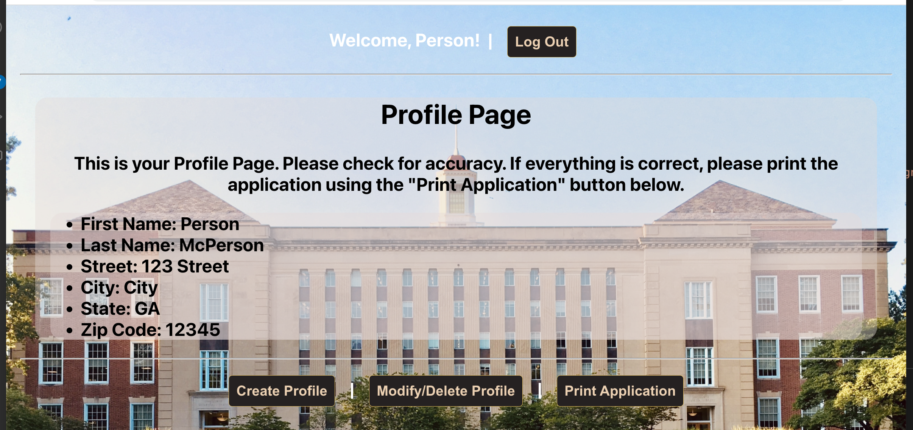
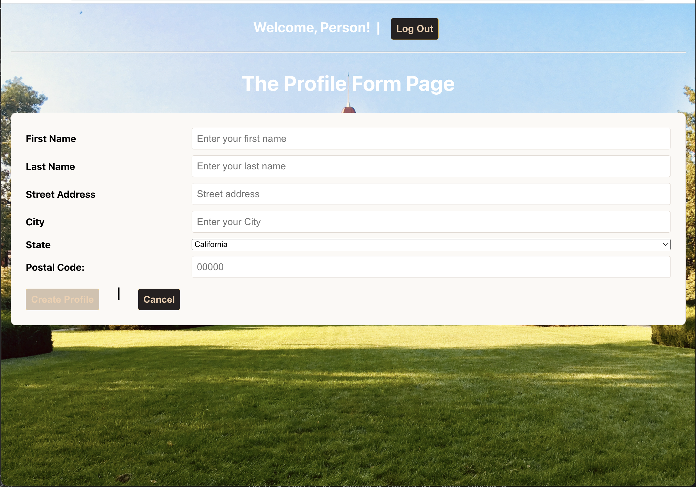
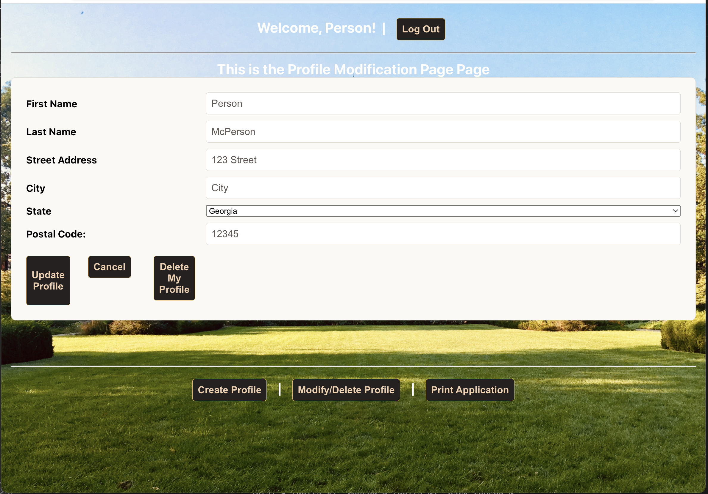

# MERNSchool

This is a proof of concept project that was conceptualized by my previous employment, but was sidelined due to my termination. This actually has roots further back from a highly interactive PDF file for students to enroll into the school, which used JavaScript. I managed to get the PDF to work properly using JavaScript despite no prior experience or training. This concept actually has roots even further back for a large State of California project I pitched as an idea, which the State then made into a reality without my involvement.

Background: My previous employment was as the IT director and IT department for a beauty/barber school. Part of the modernization involved converting a WORD filed that was modified on a per enrollment basis, which was both inefficient and labor intensive. The first decision was to make a PDF that could be printed and filled in by hand as a quick-fix. The next level was a basic PDF that could be filled out. From that simple PDF, it then grew quickly in complexity and functionality via several revisions, saving the administration valuable time. The student data was eventually entered on a one-sheet and then pushed to where needed and doing calculations based on the program selected. This PDF used JavaScript. The next evolution was to collected the data via a front end web-based form store it in a database, where administration could pull the data from an administrative web solution. This retrieved data would be pushed into a PDF that was to be printed on-site and signed by the student.

The MERNSChool project is a scaled back, streamlined and simplified version. The user still signs in and can complete their profile with minimal information as well as update and delete their profile data. If they are happy with the information they entered, they can generate a “print” page, which can then be printed and signed, thus emulating the actual enrollment agreement process.  MERNSchool is a full stack application using MongoDB, Express, React and Node and incorporates full CRUD into the process. This project uses several APIs that were created for this project.

[The School of MERN](https://ga-mernschool.herokuapp.com/)

## The Home Page

This is the basic landing page for all new users. The links to the available topics are live and populated

## Information Page Sample:

Just an example to show that the various pages are live buttons and not just decorative.

## Authentication:

The site uses a simple method of authorization and there is only one level of authentication. Users may login, shown in this example, or they may make their own new account.

## The user profile page:

This is the basic user profile page. I left space for future expansion as this project only uses a bare-bones form to collect minimal information. The purpose of this page is for the user to see and review their information for a "print" function. If the profile has been created previously, then the fields are populated. This shows READ functionality.

## Make Profile Page:

This is the basic form for the user to make their profile. The hidden field of the "email" is what is used to relate the user account with the profile. This is the CREATE function.

## Modify Profile Page:

The Profile Modification page uses the same model for creating a profile. The profile modification page retrieves the information from the user profile usng the email and pre-populates the fields. This ability to update the information is the UPDATE function. Users can also delete their profile information, which is the DESTROY function. This only deletes the profiel data, it does not delete the account. The Delete function also does not utilize any "confirmation" function at this time.

## The Print Page:

If a user's profile information is correct, they can choose to "print" the page. 

